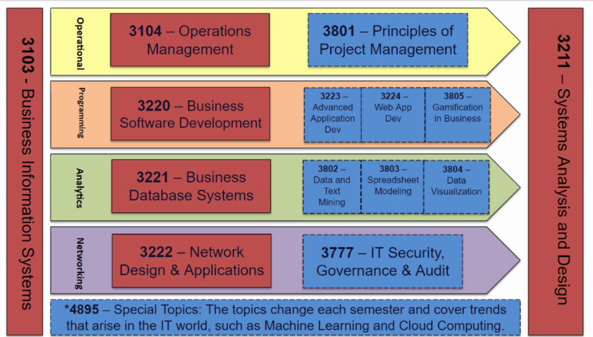

26 January 2021 / 7:00 PM / Webex

## ATTENDEES

Jon Moore, E-Board, and Members

## AGENDA

### Last Meeting Follow-up

- X

### New Business

- Experiential Learning and MIS, OPIM, Analytics Minor info session

## NOTES

- Welcome to IMA
    - OPIM - Operations and Information Management
    - MIS - Management Information Systems
    - IMA - Information Management Association
- Jon Moore
    - Curricular Roles
        - Program Director MIS
        - Instructor in Residence
        - Analytics Minor Coordinator
        - MIS Honors Advisor
    - Extracurricular Roles
        - IMA Faculty Advisor
    - Co-curricular Roles
        - Case Competition Coordinator
        - Internship Coordinator OPIM 4881
        - Service-Learning Fellow
    - Experiential Learning Roles
        - OPIM Innovate Director
- MIS Courses  
    - 
    - Open spots in classes unless filled by MIS majors and Analytics Minor
    - Experiential learning 
        - Hackathon
            - Problem Solving
            - 1-2 days
            - Team-based
            - Rapid Prototyping
        - Case Competition
            - 1-2 weeks
            - Team-based
            - Business Cases and Analysis
            - ROI/Financials
            - Presentation Skills
        - Design Challenge
            - 1-3 months
            - Mentoring and Workshops
            - Innovate Wellness Challenge
- OPIM Innovate (check the website for new updates)

## ACTION ITEMS

- Reach out here: jon.moore@uconn.edu

## NEXT WEEK’S AGENDA

- Meeting with Synchrony
