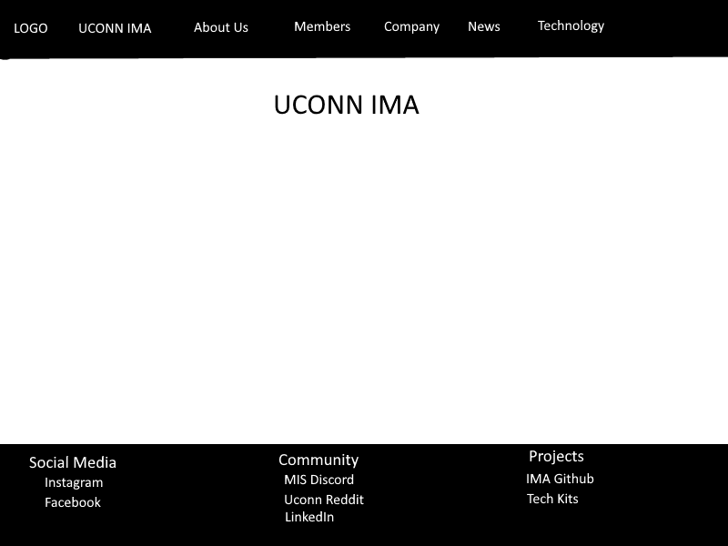
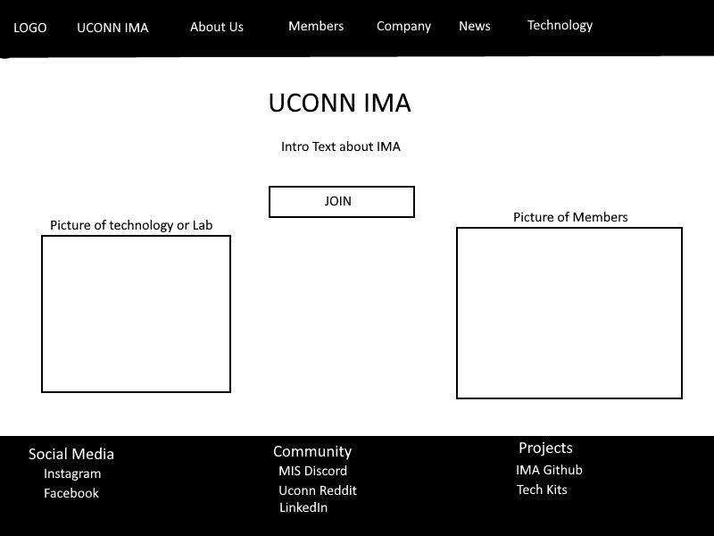
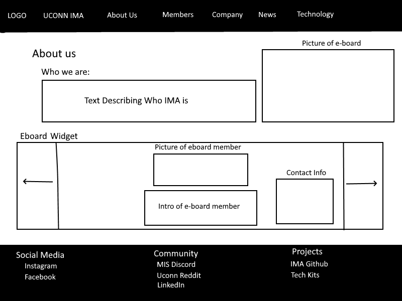
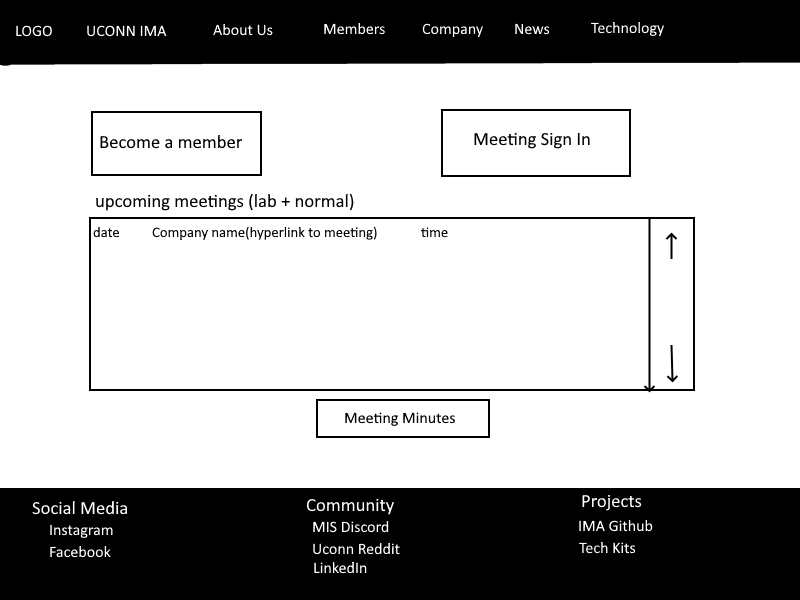
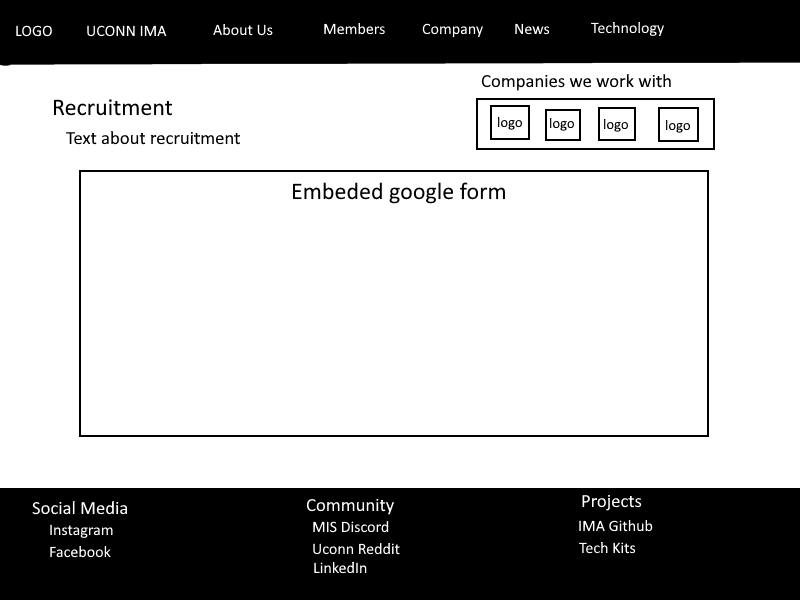
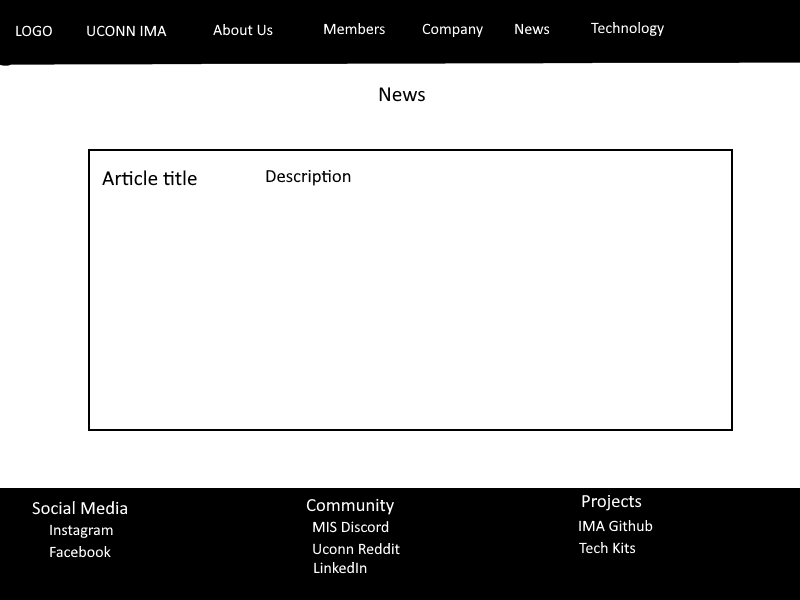

# Mockup of Website Pages

## Template page

Description of page: 

This is the template for IMA's website layout. 

It includes:

    - A fixed header and footer which will be displayed on every page of the website. 

---

## Home page

Description of page:

This is the home page for IMA's website. It is the default page that will display when users first navigate to the website. 

It includes: 

    - Introductory text: This will explain what IMA is and its overall mission.
    - JOIN button: This will link to another page where students can sign up to become an official IMA member.
    - Two pictures: One picture will display technology and another will be of club members.

---

## About us page

Description of page:

This is the page which will describe IMA in detail for those interested in learning. 

It includes: 

    - Introductory text: This will explain what IMA is and its overall mission.
    - One picture: This will be a fixed, group picture of E-Board.
    - E-Board widget: This will allow users to get a snapshot of each individual E-Board member. Each member will have their position, picture, a descriptive sentence about them, and their contact information listed. 

---

## Members page

Description of page:

This will be the central page for members to find current club information.

It includes:

    - JOIN button: This will link to another page where students can sign up to become an official IMA member.
    - SIGN IN button: This will link to another page that will allow members to sign into meetings. 
    - Upcoming Meetings widget: This will list all of the upcoming meeting information for both company meetings and lab hours. It will include the date, time, location, as well as a hyperlink to directly connect members to the proper WebEx link. 
    - Meeting Minutes button: This will link to another page where students will be able to find past meeting minutes (notes). 

---

## Company page

Description of page:

This will be a page for company relations. Here, company recruiters will be able to fill out interest forms for working with IMA.

It includes: 

    - Recruitment text: This will explain how IMA operates and encourage recruiters to fill out the embedded Google form below. 
    - Company logo section: This section will display the logos of all companies who have worked with IMA in the past. 
    - Embedded Google Form: This will include all information that is necessary to collect from companies in order for IMA to schedule meetings with them.

---

## News page

Description of page:

This will be a page that displays current news at UConn related to technology.

It includes:

    - News widget: This will contain a list of hyperlinked articles from the UConn master calendar. 
